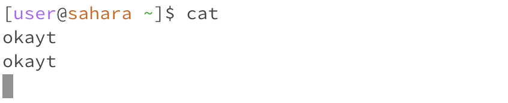

# cd command
  
Our current working directory is /home/lecture1 and when we use cd with no arguments in this directory it takes us back to our homedirectory /home. This is not an error but a feature of the command cd.
  
When cd is used with a directory as an arguement, it takes us inside that directory. We know we are inside a different directory as there is now /lecture1 after the '~' symbol. 
  
When cd is used with file as an arguement, it says 'not a directory'. This is not an error as cd is can only be used to change from one directory into another and not into a file.

# ls command
  
When ls is used without any arguements it gives a list the files of the directory we are in. Since we in the /home directory it will list 'lecture1' since that is file within the /home directory.
  
When ls is used with a path to a directory as an argument it will list the items within that directory. Since argument directory is /lecture1 it lists the files: Hello.java, Hello.class, messages, and README.
  
When ls is used with a path to a file as an argument it doesn't list the contents of the text file instead it gives us the path to the text file.

# cat command
  
When cat does not take any argument it does not do anything but let the user type stuff. This is not an error as when cat does not take in any arguments it waits for an input to be typed. To exit this press ctrl +  c.
  
When the cat command takes a path to a directory as an argument it tells us that it is directory. This is not an error as cat is used to print the contents of one or more files given by the paths.
  
When the cat command takes a path to a file as an argument it displays the contents of the file. 

