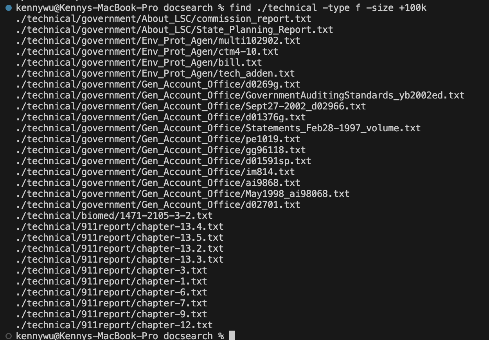

# Part 1
```
static void reverseInPlace(int[] arr) {
    for(int i = 0; i < arr.length; i += 1) {
      arr[i] = arr[arr.length - i - 1];
    }
  @Test
  public void testReverseInPlace1(){
    int[] input1 = {1, 2, 3, 4, 5};
    ArrayExamples.reverseInPlace(input1);
    assertArrayEquals(new int[]{5, 4, 3, 2, 1}, input1);
  }
	@Test 
	public void testReverseInPlace() {
    int[] input1 = { 3 };
    ArrayExamples.reverseInPlace(input1);
    assertArrayEquals(new int[]{ 3 }, input1);
	}
```
ss of test runninig i guess

## Before
```
static void reverseInPlace(int[] arr) {
    for(int i = 0; i < arr.length; i += 1) {
      arr[i] = arr[arr.length - i - 1];
    }
```
## After
```
  static void reverseInPlace(int[] arr) {
    int tempVal = 0;
    for(int i = 0; i < arr.length/*arr.length/2*/; i += 1) {
      tempVal = arr[i];
      arr[i] = arr[arr.length - i - 1];
      arr[arr.length - i - 1] = tempVal;
    }
  }
```

# Part 2  
[Find Command Manual Page](https://man7.org/linux/man-pages/man1/find.1.html#OPTIONS)  
I used this link to find possible options for the find command. Additionally it provides information about these additional options.  
  
  
The -ls optoin for the find command provides detailed information about each directory, including its permissions, owner, group, size, modification date, and name. Since we gave the additional optoin of the size being more than 10 kibibytes, it only gave us the ./techinical/biomed directory since that was the only one.   
  
  
Similarly to above, it provides us with files that are more than 10 kibibytes. The reason it only gives us files is due to the -type option being used.  
  
  
This showcases the use of the -name option in find with -type d option. A combination of these two option returns us directories with "9" in the name. It could be useful if you can't remember the directories fullname but remember pieces of it or you just want directories that contain a certain characters or strings.
  
  
  
  
  
  
  
  
  
 
