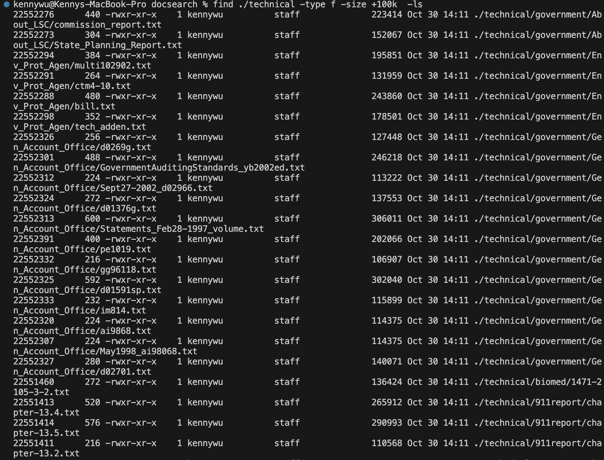
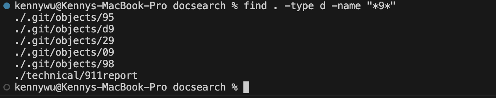
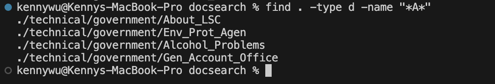
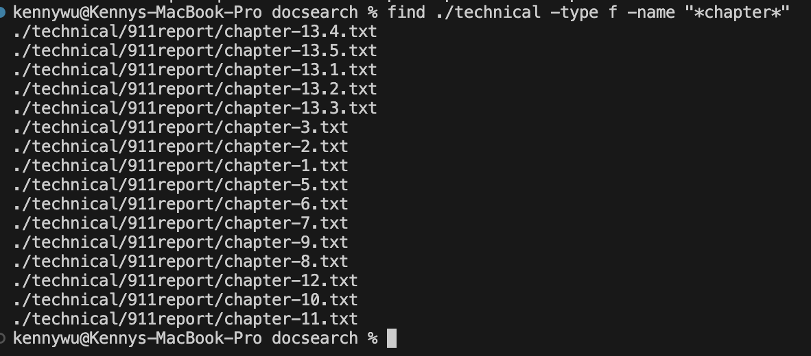
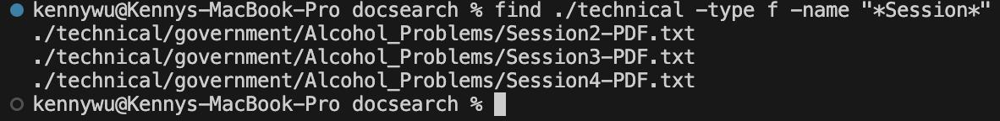

# Part 1
```
static void reverseInPlace(int[] arr) {
    for(int i = 0; i < arr.length; i += 1) {
      arr[i] = arr[arr.length - i - 1];
    }
  @Test
  public void testReverseInPlace1(){
    int[] input1 = {1, 2, 3, 4, 5};
    ArrayExamples.reverseInPlace(input1);
    assertArrayEquals(new int[]{5, 4, 3, 2, 1}, input1);
  }
	@Test 
	public void testReverseInPlace() {
    int[] input1 = { 3 };
    ArrayExamples.reverseInPlace(input1);
    assertArrayEquals(new int[]{ 3 }, input1);
	}
```
ss of test runninig i guess

## Before
```
static void reverseInPlace(int[] arr) {
    for(int i = 0; i < arr.length; i += 1) {
      arr[i] = arr[arr.length - i - 1];
    }
```
## After
```
  static void reverseInPlace(int[] arr) {
    int tempVal = 0;
    for(int i = 0; i < arr.length/*arr.length/2*/; i += 1) {
      tempVal = arr[i];
      arr[i] = arr[arr.length - i - 1];
      arr[arr.length - i - 1] = tempVal;
    }
  }
```

# Part 2  
  
  
  
  
  
  
  
  
  
  
  
  
  
  
 
