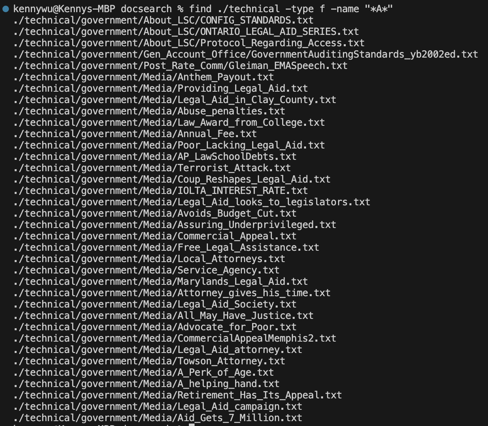

# Part 1
```
static void reverseInPlace(int[] arr) {
    for(int i = 0; i < arr.length; i += 1) {
      arr[i] = arr[arr.length - i - 1];
    }
  @Test
  public void testReverseInPlace1(){
    int[] input1 = {1, 2, 3, 4, 5};
    ArrayExamples.reverseInPlace(input1);
    assertArrayEquals(new int[]{5, 4, 3, 2, 1}, input1);
  }
	@Test 
	public void testReverseInPlace() {
    int[] input1 = { 3 };
    ArrayExamples.reverseInPlace(input1);
    assertArrayEquals(new int[]{ 3 }, input1);
	}
```
ss of test runninig i guess

## Before
```
static void reverseInPlace(int[] arr) {
    for(int i = 0; i < arr.length; i += 1) {
      arr[i] = arr[arr.length - i - 1];
    }
```
## After
```
  static void reverseInPlace(int[] arr) {
    int tempVal = 0;
    for(int i = 0; i < arr.length/*arr.length/2*/; i += 1) {
      tempVal = arr[i];
      arr[i] = arr[arr.length - i - 1];
      arr[arr.length - i - 1] = tempVal;
    }
  }
```

# Part 2  
[Find Command Manual Page](https://man7.org/linux/man-pages/man1/find.1.html#OPTIONS)  
I used this link to find possible options for the find command. Additionally it provides information about these additional options.  
  
  
The -ls optoin for the find command provides detailed information about each directory, including its permissions, owner, group, size, modification date, and name. Since we gave the additional option of the size being more than 10 kibibytes, it only gave us the ./techinical/biomed directory since that was the only one.   
  
  
Similarly to above, this provides detailed information about each file that are within the our given constraints which is -type f and -size 10k. It also provides us a path to the file which can make looking for it easier.
  
  
This showcases the use of the -name option in find with -type d option. A combination of these two option returns us directories with "9" in the name. It could be useful if you can't remember the directories fullname but remember pieces of it or you just want directories that contain a certain characters or strings.
  
  
This showcases the -name and -type option for the find command. The combination of these two option gives us files that contain "A" in the name. This can be used in a multitude of ways like finding files you can't remember the name of but remember some of the words or characters for the name of that file.
  
  
The command -size simply returns us files or directories that match our size constraint which can be greater than, equal to, or less than the given constraint. In our case it gives directories due to the -type d option. This is useful for finding especially large directories or empty directories that just take up space.  
  
  
Similar explanation as above for -size, this gave files that are more than 10k. Useful for finding really large files that take up space or possibly finding files that contain nothing in them.
  
  

  
 
