# Step 4  
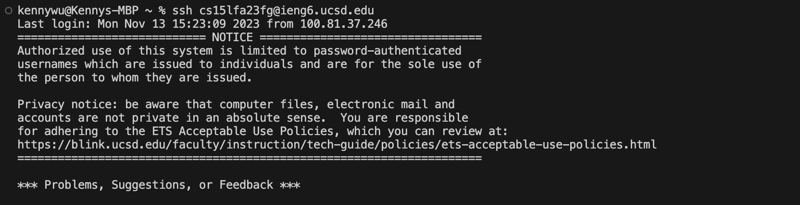  
I pressed the ```<up>``` 7 times then pressed ```<enter>``` because I used ssh command in the terminal for someting else.    

# Step 5  
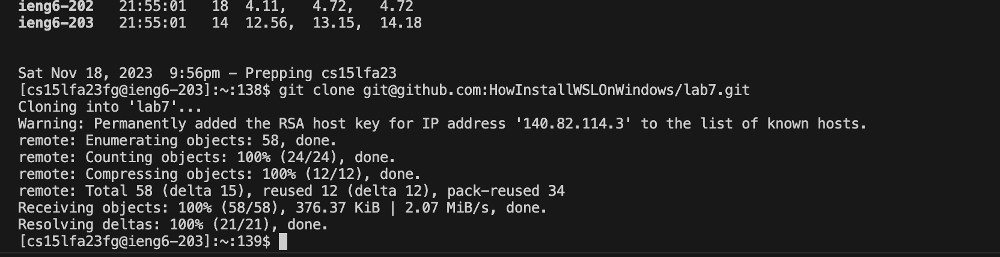  
I typed ```git clone``` then went over the cloned repository for lab7. Clicked the ```<>Code``` test box. Clicked ```SSH``` and highlighted the link using my mouse cursor by dragging and clicking over the link. Then I pressed ``` Command + C``` to copy what I just highlighted. Then I went back over to my VSCode terminal that was logged into UCSD remote server. I pressed ```Command + V``` to paste what I copied. Then I hit ```<enter>```.  

# Step 6  
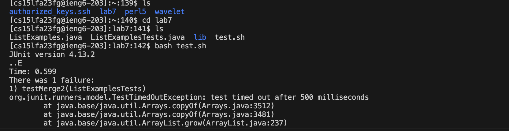  
I typed ```ls``` and press ```<enter>``` to get a list of the files/directories in my current pwd. I then typed ``` cd lab7``` and ```<enter>``` to change my current pwd to lab7. I once again typed ```ls``` and pressed ```<enter>``` to get a list of the files/directories in lab7. After seeing the files in lab7. I typed ``` bash test.sh``` to run the bash script for the tests.  
  
# Step 7  
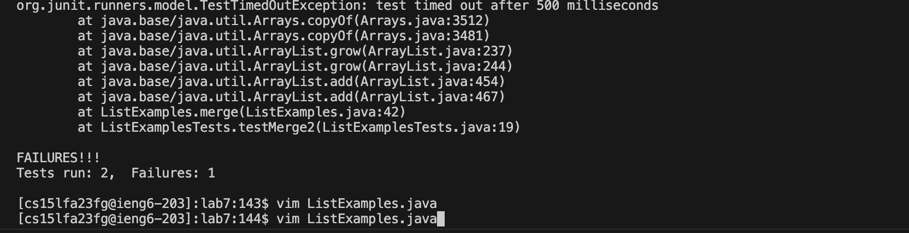  
I first typed ```vim``` into my terminal. Then I scrolled up and used ```Cmd + C``` to copy ListExamples.java. Then used ```Cmd + V``` to paste the ListExamples.java into terminal then I pressed ```<enter>``` to enter vim.  
  
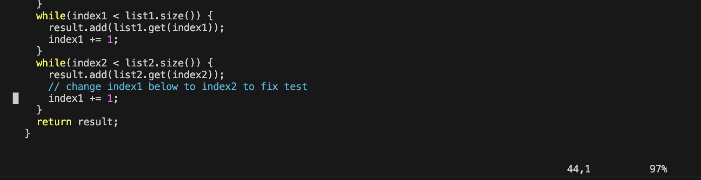  
I held down the ```<down>``` key until I reached line 44 which was the line that needed to be changed. Additionally, it is possbile to scroll down instead of clicking the same key multiple times or holding a key down.  
  
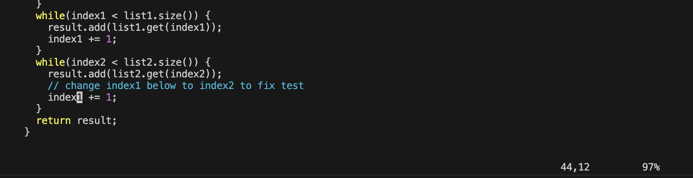  
I then held down then ```<right>``` arrow unitl my cursor was hovering over the "1'" character.  
  
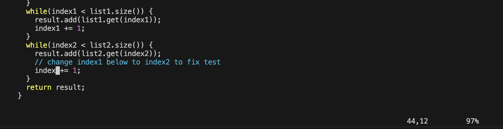  
Then I pressed the ```x``` key to delete the "1" character.  
  
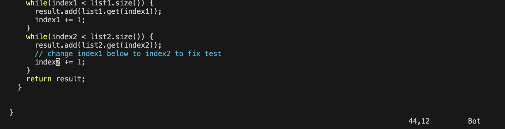  
For this I pressed ```i``` to enter insert mode. Then I pressed ```2``` since that is the character I want to insert. Then I pressed ```esc``` to enter back into normal mode.  
  
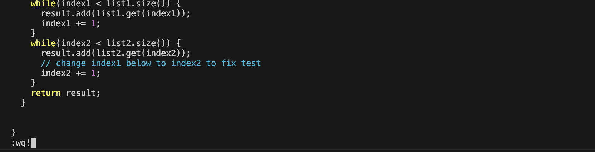  
I typed ```shift+;``` to enter Execute mode. Then typed ```wq!``` to write and quit the vim.  

# Step 8  
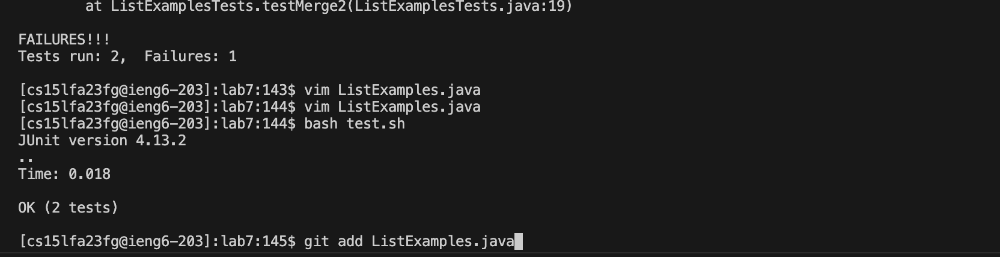  
Then I clicked the ```<up>``` twice to get back "bash test.sh". Then I pressed ```<enter>``` to rerun the tests. Which shows that it passed. I then typed ```git add``` and pressed ```cmd + v``` to paste ListExamples.java. Then pressed ```<enter>```.  

# Step 9  
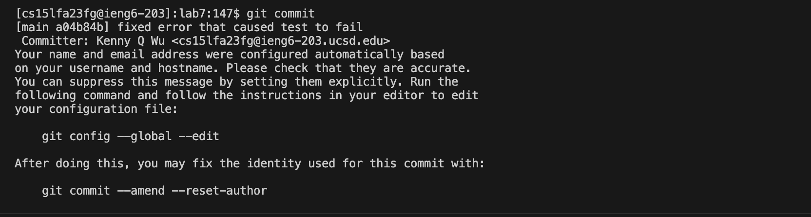  
In this step I typed ```git commit``` and pressed ```<enter>``` to enter my commit message for what I just added. I then typed ```fixed error that caused test to fail``` as my message. I then typed ```shift + ;``` to enter Execute mode. I then typed ``` wq!``` to write/save my message and exit. 
