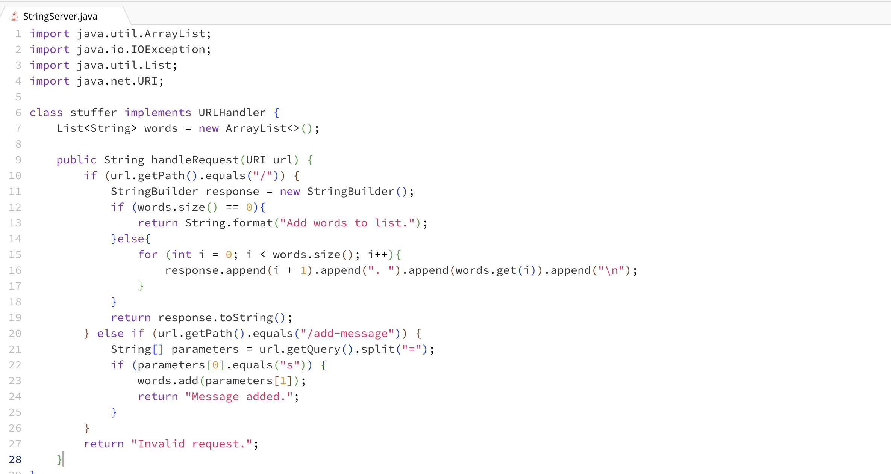
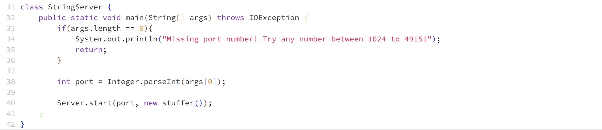
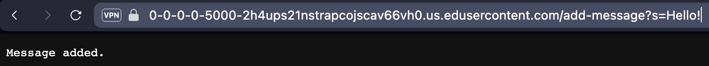
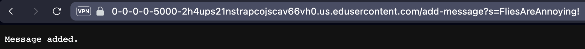

# Part 1

  
  
The methods called when doing /add-message in my code are handleRequest(URI url) with url being the incoming argument that is getting passed through URI. The other method called is .getPath() which gives the string representation of the files pathname. It fails the initial if statement since the path is /add-message. So it goes goes to the 'else if' statement which it passes. It then calls the .getQuery() method with the relavent argument being url. Then the .split("=") method is called with the relavent argument being "=". The next method called is .equal("s") with the relavent argument being "s". Which checks if the index 0 of String array parameters is s, if it is the .add(parameters[1]) method is called. This method adds index 1 of parameters to String list words. It does this whenever path is /add-message. 

# Part 2  
![Image] (lsprivkey.png)
![Image] (lspubkey.png)
![Image] (terminteract.png)

# Part 3
Something new I learned from lab in week 2 was building and running a server. It was enjoyable creating and running the webserver, NumberServer.java. Additionally, running a remote server was also something new I learned. I thought running a remote server would be something similar to a VPN. 
