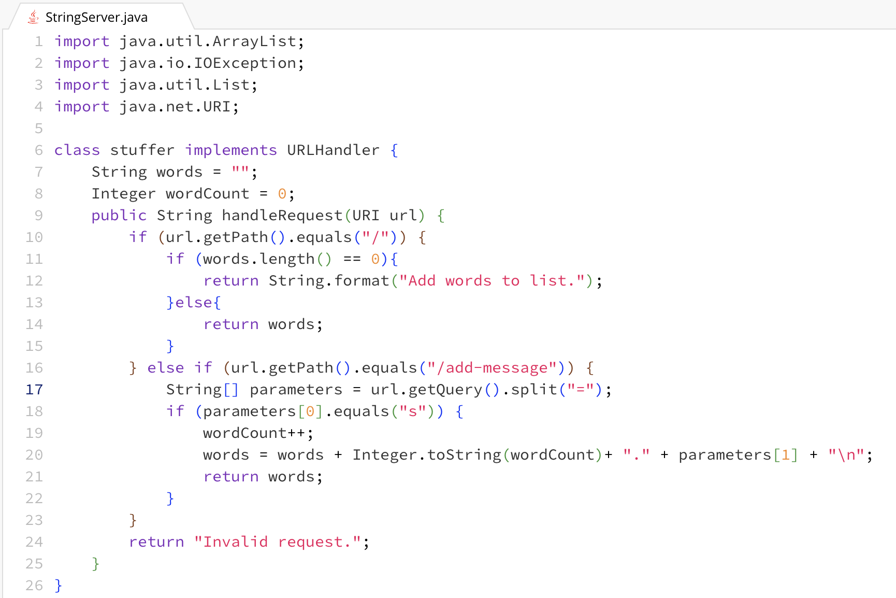
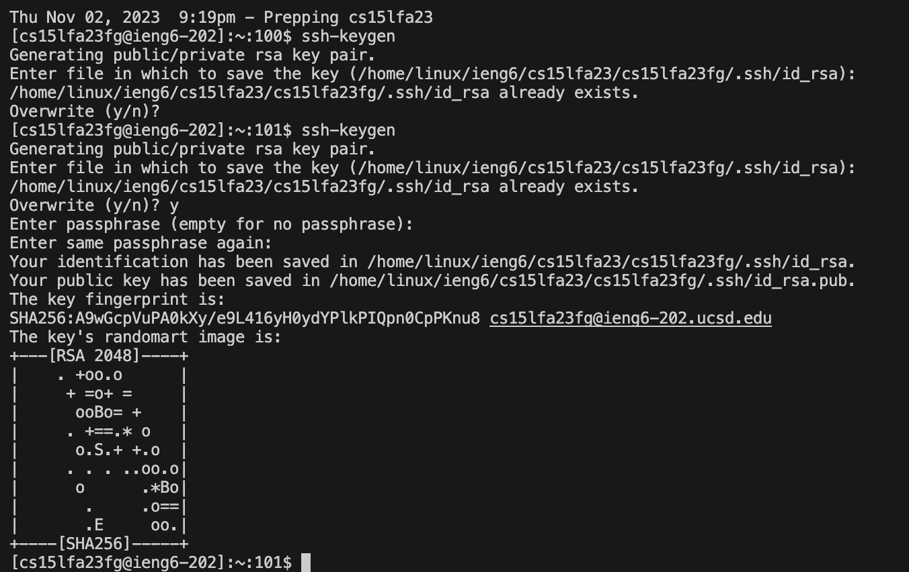
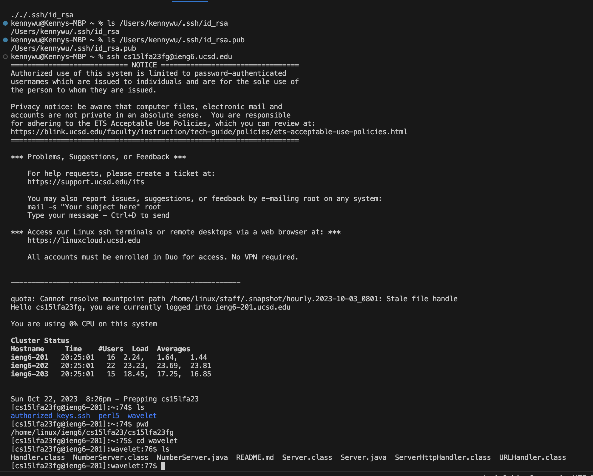

# Part 1

  
  
The code starts the the initialization of String words = ""; and Integer wordCount = 0;  
  
The methods called when doing /add-message in my code are handleRequest(URI url) with url being the incoming argument that is getting passed through URI. The other method called is .getPath() which gives the string representation of the files pathname.  
  
The initial if statement fails since the path is /add-message. So it goes goes to the 'else if' statement which it passes. It then calls the .getQuery() method with the relavent argument being url. Then the .split("=") method is called with the relavent argument being "=". The split method breaks the string at our seperator which is "=".  
  
The next method called is .equal("s") with the relavent argument being "s". Which checks if the index 0 of String[] parameters is s. If the parameter[0] is "s", wordCount is incremented by 1 and word is set to be "words + Integer.toString(wordCount)+ "." + parameters[1] + "\n"". Methods used in this is the Integer.toString method which converts Integer wordCount to a String since words is a String and not doing this can cause type mismatch. Then it returns words.  
  
In the second message, similar to the first message, it calls the .equals("s") to see if String[] parameters[0] is s. Then word count is incremented by one. Since this is the second message word count should be 2. Then word = words + Integer.toString(wordCount)+ "." + parameters[1] + "\n". The methods do the exact same thing as when the first message is added. However by adding words + words, we are ensuring that the previous word is included instead of entirely replacing initial or previous words.  
  

# Part 2  
  
  
  
  

# Part 3
Something new I learned from lab in week 2 was building and running a server. It was enjoyable creating and running the webserver, NumberServer.java. Additionally, running a remote server was also something new I learned. I thought running a remote server would be something similar to a VPN. 
