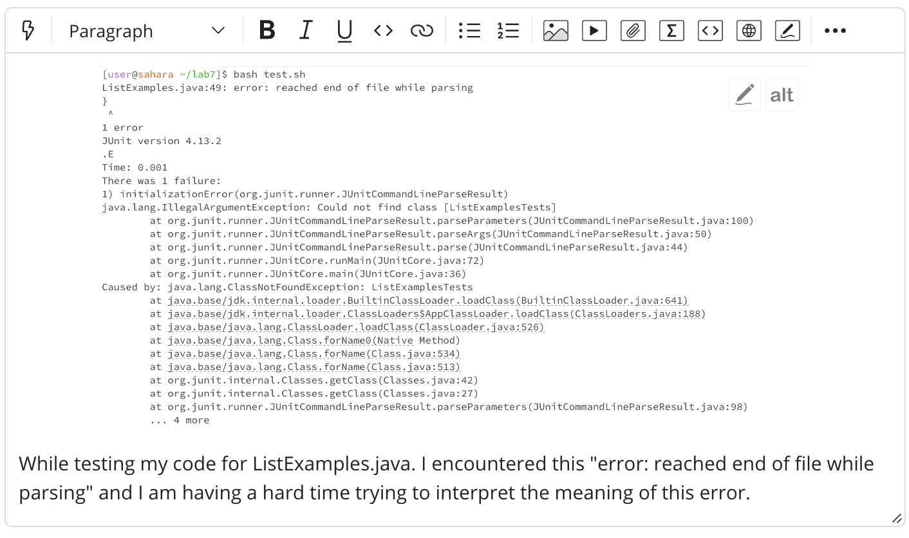
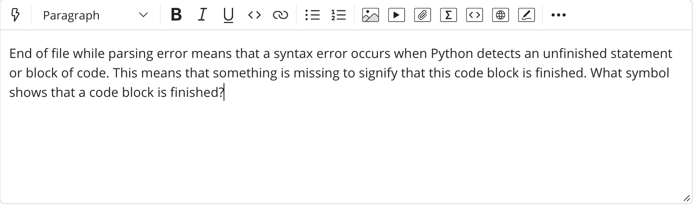
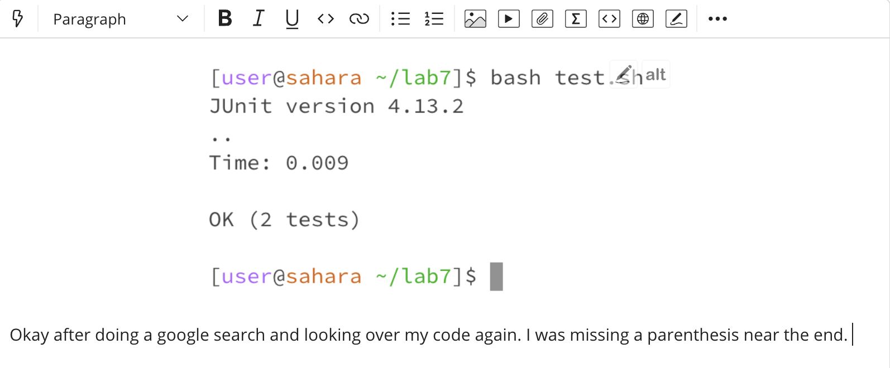

# Part 1  
## Part 1.1  
  
 
  
  
The directory needed is named "lab7" with a subdirectory named "lib" within it. The files contained within the lib directory are "ListExamples.java", "ListExampplesTests.java", and "test.sh".  
This is the code for ListExamples.java before the fix:  
```
import java.util.ArrayList;
import java.util.List;

interface StringChecker { boolean checkString(String s); }

class ListExamples {

  // Returns a new list that has all the elements of the input list for which
  // the StringChecker returns true, and not the elements that return false, in
  // the same order they appeared in the input list;
  static List<String> filter(List<String> list, StringChecker sc) {
    List<String> result = new ArrayList<>();
    for(String s: list) {
      if(sc.checkString(s)) {
        result.add(0, s);
      }
    }
    return result;
  }


  // Takes two sorted list of strings (so "a" appears before "b" and so on),
  // and return a new list that has all the strings in both list in sorted order.
  static List<String> merge(List<String> list1, List<String> list2) {
    List<String> result = new ArrayList<>();
    int index1 = 0, index2 = 0;
    while(index1 < list1.size() && index2 < list2.size()) {
      if(list1.get(index1).compareTo(list2.get(index2)) < 0) {
        result.add(list1.get(index1));
        index1 += 1;
      }
      else {
        result.add(list2.get(index2));
        index2 += 1;
      }

    while(index1 < list1.size()) {
      result.add(list1.get(index1));
      index1 += 1;
    }
    while(index2 < list2.size()) {
      result.add(list2.get(index2));
      index2 += 1;
    }
    return result;
  }


}

```
  
Code for ListExamplesTest.java before the fix:  
```
import static org.junit.Assert.*;
import org.junit.*;
import java.util.*;
import java.util.ArrayList;


public class ListExamplesTests {
	@Test(timeout = 500)
	public void testMerge1() {
    		List<String> l1 = new ArrayList<String>(Arrays.asList("x", "y"));
		List<String> l2 = new ArrayList<String>(Arrays.asList("a", "b"));
		assertArrayEquals(new String[]{ "a", "b", "x", "y"}, ListExamples.merge(l1, l2).toArray());
	}
	
	@Test(timeout = 500)
        public void testMerge2() {
		List<String> l1 = new ArrayList<String>(Arrays.asList("a", "b", "c"));
		List<String> l2 = new ArrayList<String>(Arrays.asList("c", "d", "e"));
		assertArrayEquals(new String[]{ "a", "b", "c", "c", "d", "e" }, ListExamples.merge(l1, l2).toArray());
        }

}
```
  
```
Code for test.sh before the fix:  
javac -cp .:lib/hamcrest-core-1.3.jar:lib/junit-4.13.2.jar *.java
java -cp .:lib/hamcrest-core-1.3.jar:lib/junit-4.13.2.jar org.junit.runner.JUnitCore ListExamplesTests

```
The line command that triggered the error is `bash test.sh`. To fix the bug, you had to read through the code and find where there was a missing `}` and them inserting `}` to fix the bug.  

ListExamples.java after fix:  
```
import java.util.ArrayList;
import java.util.List;

interface StringChecker { boolean checkString(String s); }

class ListExamples {

  // Returns a new list that has all the elements of the input list for which
  // the StringChecker returns true, and not the elements that return false, in
  // the same order they appeared in the input list;
  static List<String> filter(List<String> list, StringChecker sc) {
    List<String> result = new ArrayList<>();
    for(String s: list) {
      if(sc.checkString(s)) {
        result.add(0, s);
      }
    }
    return result;
  }


  // Takes two sorted list of strings (so "a" appears before "b" and so on),
  // and return a new list that has all the strings in both list in sorted order.
  static List<String> merge(List<String> list1, List<String> list2) {
    List<String> result = new ArrayList<>();
    int index1 = 0, index2 = 0;
    while(index1 < list1.size() && index2 < list2.size()) {
      if(list1.get(index1).compareTo(list2.get(index2)) < 0) {
        result.add(list1.get(index1));
        index1 += 1;
      }
      else {
        result.add(list2.get(index2));
        index2 += 1;
      }
    }
    while(index1 < list1.size()) {
      result.add(list1.get(index1));
      index1 += 1;
    }
    while(index2 < list2.size()) {
      result.add(list2.get(index2));
      index2 += 1;
    }
    return result;
  }


}
```
  
# Part 2  
  
Something interesting I leanred that was not only a `git clone` command but also a `git push`, `git add`, and `git commit` command that made making changes in git easier. Another interesting thing, was the use of jdb. Setting up breakpoints at was especially useful and seems to have a multitude of uses. 
